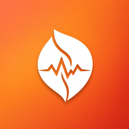
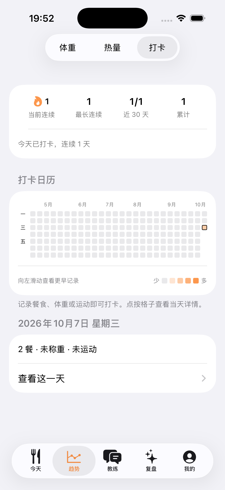

<p align="center"></p>

<h1 align="center">健康助手</h1>

<p align="center">拍一张照片就能记录热量的 iOS 减脂助手。所有数据保存在手机本地，AI 能力通过你自己的 OpenRouter Key 调用。</p>

## 功能

- **拍照记饮食**：拍照、从相册选图或写一句描述，先由识别模型认出食物、估算克数，再由热量模型给出每 100 克的营养数值。每餐都会显示误差范围（± 多少 kcal）。可以修改克数、补充说明（如“饭只吃了一半”）后重新估算，也可以直接手动填写热量。
- **营养目标**：根据身高、体重、年龄、活动水平和减重速度计算每日热量和蛋白质目标；有体脂率或体脂秤读数时可换用更准的基础代谢算法。记录满 3 周后，会按实际摄入和体重变化建议微调目标。
- **营养质量**：除三大营养素外，还统计膳食纤维、钠和添加糖，并与膳食指南的参考值对比。
- **运动**：用一句话描述运动（如“慢跑 5 公里，然后练了 30 分钟腿”），AI 解析项目和强度，按 MET 计算消耗，并按设定比例加回当天额度。
- **体重与身体状态**：体重趋势线（滤掉每天喝水、饮食造成的波动）、预计达成日期、体脂和腰围记录，以及 AI 身体评估。
- **AI 教练**：每日总结、每周复盘、结合你的真实数据聊天，还能先对话了解需求，再生成每周训练计划。
- **健康风险提醒**：多天吃得过少、减重过快、目标体重偏低、暴食后节食等情况会在首页温和提醒，AI 回答时也会参考这些提醒。
- **打卡热力图**：类似 GitHub 的贡献图，记了饮食、体重或运动就算打卡，并显示连续天数。
- **Apple 健康**：导入体重、体脂率、腰围；把饮食营养和体重写入健康 App；读取步数和活动能量作参考。
- **其他**：
  - 识别和 AI 任务在后台继续运行，完成后发通知。
  - 支持每日提醒（称体重、三餐、总结）。
  - 可以显示 OpenRouter 余额和花费，余额不足时提醒。
  - 支持导出 JSON 备份。

<p align="center"></p>

## 安装

需要一台 Mac（Xcode 26 或更新版本）和一部 iOS 17 及以上的 iPhone。App 没有上架，需要自己用 Xcode 安装：

1. 克隆仓库，用 Xcode 打开 `EnergyTracker.xcodeproj`。
2. 在 Xcode → Settings → Accounts 登录 Apple ID（免费账号即可）。
3. 选中 `EnergyTracker` target → Signing & Capabilities：
   - Team 选你自己的账号；
   - Bundle Identifier 改成一个唯一的值，例如 `com.yourname.EnergyTracker`。
   - 项目启用了 HealthKit，保持 Automatic signing，Xcode 会自动生成包含 HealthKit 的描述文件。
4. 用数据线连接 iPhone，打开 iPhone 的「设置 → 隐私与安全性 → 开发者模式」，然后在 Xcode 中选择这部 iPhone，点 Run。
5. 首次打开时，如果提示“不受信任的开发者”，到 iPhone「设置 → 通用 → VPN 与设备管理」里信任你的开发者证书。

> 免费 Apple ID 签名的 App 每 7 天需要用 Xcode 重新安装一次，数据不会丢失。付费开发者账号签名的有效期是一年。

## 首次设置

1. **填写 API Key**：在 [OpenRouter](https://openrouter.ai/keys) 创建一个 Key（建议设置消费上限），打开「我的 → 模型与 API Key」粘贴，点「测试连接」。Key 只保存在本机钥匙串里。
2. **填写个人资料**：「我的 → 个人资料与目标」里填写性别、出生年份、身高、当前体重、活动水平、目标体重和每周减重速度，App 会算出每日热量和蛋白质目标。
3. **可选设置**：
   - 「我的 → Apple 健康」：连接健康 App，同步体重和饮食数据；
   - 「我的 → 每日提醒」：打开需要的提醒；
   - 「我的 → 身体状态与 AI 评估」：录入体脂率、腰围，生成一份身体评估。

## 日常使用

- **记一餐**：在「今天」页点右上角 **+**：
  - 拍照或写描述，选择餐次和油量（不确定就选“自动”），点「开始识别」，大约 1–3 分钟出结果，期间可以切走 App。
  - 包装食品或已知热量的，切到「直接填热量」，不会调用 AI。
- **修正结果**：点进某一餐：
  - 点某项食物可以改克数或名称（只改克数时直接按比例重算，不再调用模型）；
  - 在「补充修正」里写“汤没喝”“其实是两碗饭”之类的说明，模型会重新调整；
  - 橙色的“份量把握较低”提示表示这一项最值得核对。
- **记体重**：「今天」页点体重一行。建议每天早上空腹称，主要看趋势线，单日数字参考意义不大。
- **记运动**：「今天」页点「记录运动」，用一句话描述即可。如果有训练计划，练完当天的训练后，点计划下面的按钮就能直接记下这次训练。
- **看总结**：「今天」页底部可以生成当日 AI 总结；「复盘」页生成周复盘；「教练」页可以随时提问或制定训练计划。
- **看趋势**：「趋势」页有体重趋势、每日热量历史和打卡热力图。

## 模型

所有模型都通过 OpenRouter 调用，可以在「我的 → 模型与 API Key」中更换，填 OpenRouter 上的模型 ID 即可。下面的默认值是用 [Nutrition5k](https://github.com/google-research-datasets/Nutrition5k) 菜品和常见中餐对比测试后选出来的：

| 用途 | 默认模型 |
|---|---|
| 识别食物、估算克数 | `qwen/qwen3.8-max-0902` |
| 每 100 克营养数值 | `deepseek/deepseek-v4.1-flash`（开启深度思考） |
| 运动解析 | `moonshotai/kimi-k3` |
| 身体评估、总结、复盘、聊天、训练计划 | `moonshotai/kimi-k3` |

一餐照片的识别和估算成本约 2 美分。照片估算的热量误差通常在 ±20–30%，主要来自份量和用油，记录的价值更多在于长期趋势和习惯。

## 数据与隐私

- 饮食、体重、照片等数据都保存在手机本地（SwiftData），不会上传到除 OpenRouter 以外的任何服务器。发给 OpenRouter 的只有识别和分析需要的内容：照片、文字描述、相关的统计数据。
- 删除 App 会清空所有数据，建议定期在「我的 → 数据备份」导出备份（可以选择是否包含照片），之后可以从备份文件恢复。
- AI 给出的内容仅供参考，不构成医疗建议。

## 开发

- 技术栈：SwiftUI、SwiftData、HealthKit，最低 iOS 17。没有第三方依赖。
- 目录结构：
  - `EnergyTracker/Models`：数据模型；
  - `EnergyTracker/Services`：模型调用、提示词（`Prompts.swift`）、目标计算、HealthKit 同步、备份等；
  - `EnergyTracker/Views`：界面。
- 离线测试：运行 `Tests/run-offline.sh`，会编译真实的计算、模型和备份代码并做检查，不联网、不启动 App。
- 命令行构建（模拟器）：

  ```sh
  xcodebuild -project EnergyTracker.xcodeproj -scheme EnergyTracker \
    -destination 'platform=iOS Simulator,name=iPhone 17' build
  ```
